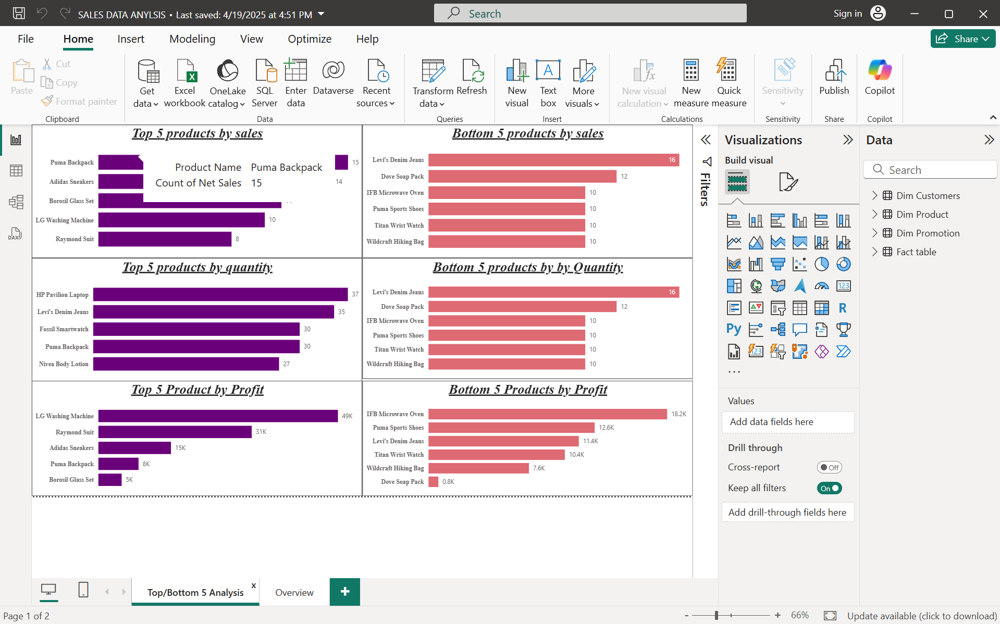
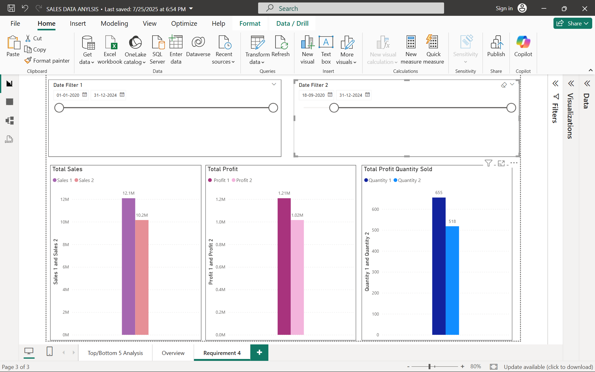
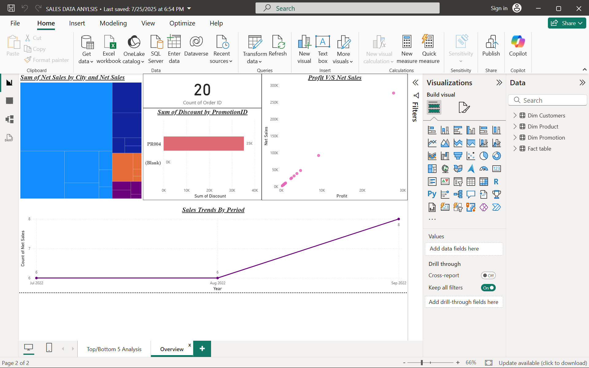

# Power BI Sales Data Analysis & Data Modeling Portfolio Project

## 📌 Project Overview
This repository showcases an end-to-end Power BI data intelligence solution designed to transform raw transactional sales figures into an actionable, multi-page analytical dashboard. 

The primary business goal of this project is to audit sales trends, track profitability streams, isolate top/bottom performing product lines, and analyze the distribution of marketing discounts across various promotions and regions.

---

## 🏗️ Relational Architecture & Data Modeling
The heart of this analytics system relies on a strictly structured **Star Schema** to enforce optimal query speeds and clean filter propagation. 

* **Fact Table:** `Fact table` containing transactional records (`Net Sales`, `Units Sold`, `Profit`, `Discount`, `Price Per unit`).
* **Dimension Tables:** Formulated with 1-to-many ($1:\infty$) relational links pointing toward the fact table:
  * `Dim Product` (Maintains Product ID, Product Name, Product Line, and base Price Per Unit)
  * `Dim Customers` (Tracks Customer Details, City, State, and Pincodes)
  * `Dim Promotion` (Profiles marketing elements including Coupon Codes and Promotion Names)
  * `Date Table 1` & `Date Table 2` (Enables independent multi-period timeline analysis)
* **Measures Grouping:** All custom DAX metrics are stored cleanly in a standalone `Measures Table`.


---

## 🛠️ Dashboard Breakdown & Core Layouts

### 1. Central Data Ledger (Overview & Dynamic Slicers)
* Built a central tabular reporting layout tracking complete row-level item transactions.
* Implemented highly responsive dimension slicers (`Date`, `Customer Name`, `Product Name`, and `Promotion Name`) using custom visual edit interactions to prevent trend distortion during ad-hoc filtering.


### 2. Performance Tracking: Top vs. Bottom Products
* Engineered concurrent horizontal ranking metrics to immediately contrast performance across three direct core arrays: **Sales Volume**, **Quantity Sold**, and **Net Profit**.
* *Insight Example:* Automatically highlights core operational anomalies, such as an item moving vast physical quantities but returning weak or negative net profits due to compressed margins.



### 3. Requirements Auditing (Advanced Performance Comparison)
* **Dual Timeline Slicing:** Created a dedicated environment matching parallel, isolated time frames (`Date Filter 1` vs `Date Filter 2`) to let business managers run immediate structural checks of running metrics (`Total Sales`, `Total Profit`, `Total Quantity Sold`) between two distinct operating periods.



### 4. Market Distributions & Promotion Analysis
* **Geographical Clustering:** Integrated a deep visual Treemap mapping `Sum of Net Sales by City` to instantly display regional market size.
* **Discount Efficiency Tracking:** Plotted specific promotional charts mapping discount concentration (e.g., Campaign `PR004` claiming the massive bulk of total discount value).
* **Correlation Mapping:** Utilized a `Profit V/S Net Sales` scatter plot to separate linear scaling revenue paths from marginal outliers.



---

## 📊 Business Insights Uncovered
* **Margin Compression Risks:** Analysis proves that heavy transactional volume doesn't inherently build profitability. High-volume items frequently drift into the bottom net profit slots due to structural cost baselines or over-extended pricing reductions.
* **Promotional Over-Reliance:** Coupon audit visuals demonstrate a strong concentration of campaign engagement funneling strictly through a single campaign tier (`PR004`). This alerts stakeholders to potential revenue vulnerability if that single promotion structure changes.

---

## 📂 Repository Contents
* **`SALES DATA ANYLSIS.pbix`**: The underlying Power BI Desktop development file containing the final visuals, relational keys, and data models.
* **`/Screenshots/`**: Local subfolder hosting the specific visual interface captures embedded across this documentation file.

---

## 🚀 How to Run and Interact with the File
1. Download and install the latest version of [Power BI Desktop](https://powerbi.microsoft.com/desktop/).
2. Clone this repository to your local machine using terminal:
   ```bash
   git clone [https://github.com/YOUR_USERNAME/YOUR_REPOSITORY_NAME.git](https://github.com/YOUR_USERNAME/YOUR_REPOSITORY_NAME.git)
